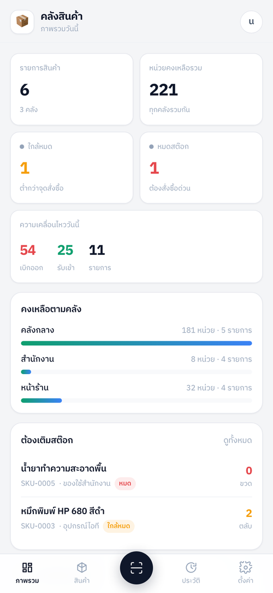
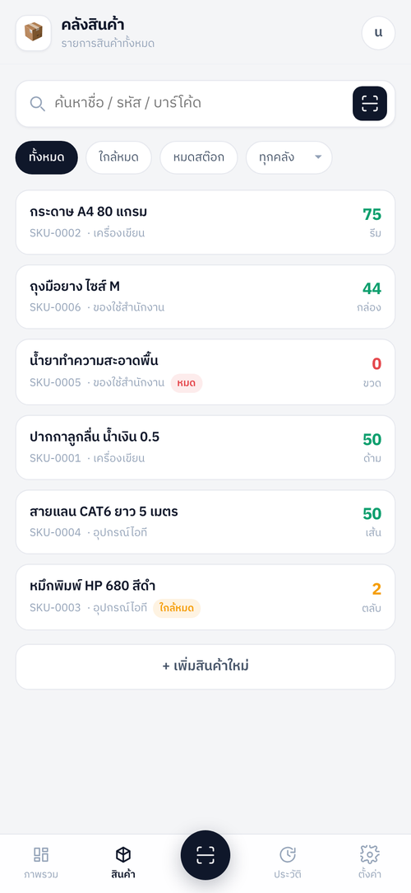
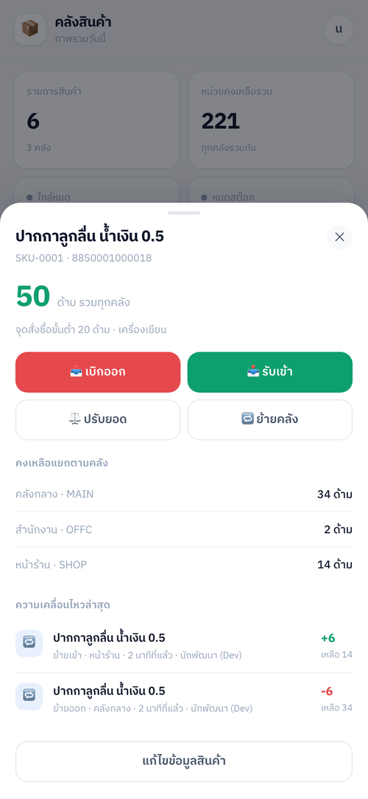
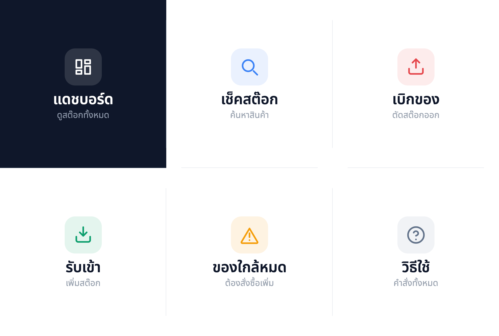

<div align="center">

# 📦 LINE Stock

**ระบบจัดการสต๊อกสินค้าที่สั่งงานผ่านแชท LINE พร้อมแดชบอร์ดในแอป LINE**
รันบน Cloudflare Workers + D1 · ค่าใช้จ่าย 0 บาทสำหรับการใช้งานทั่วไป

[](https://workers.cloudflare.com/)
[](https://developers.cloudflare.com/d1/)
[](https://developers.line.biz/)
[](LICENSE)





</div>

---

## 🚀 เริ่มเร็วสุด — ก๊อปข้อความนี้ไปวางให้ AI

ไม่ต้องเขียนโปรแกรมเป็น ไม่ต้องรู้จักเทอร์มินัล
ติดตั้ง [**OpenCode**](https://opencode.ai/download) (มี desktop app ดับเบิลคลิกติดตั้งได้เลย)
เปิดโปรแกรม แล้ววางข้อความนี้ทั้งก้อน

```text
ช่วยติดตั้งระบบจัดการสต๊อกผ่าน LINE ให้ผมหน่อยครับ

โปรเจกต์อยู่ที่ https://github.com/ManageWithNoobItGuy/line-stock-bot
ให้ clone ลงมาในเครื่องผมก่อน แล้วอ่านไฟล์ AGENTS.md ในนั้นให้จบ
จากนั้นพาผมติดตั้งทีละขั้นตามที่เขียนไว้

ข้อมูลของผม:
- ผมเขียนโปรแกรมไม่เป็น อธิบายด้วยภาษาคนธรรมดา อย่าใช้ศัพท์เทคนิคลอย ๆ
- ผมยังไม่ได้สร้างอะไรใน LINE และ Cloudflare เลย
- ขั้นไหนที่คุณรันคำสั่งแทนผมได้ ให้รันเลย
- ขั้นไหนที่ผมต้องไปกดเองบนเว็บ ให้บอกชัด ๆ ว่าเข้าเว็บไหน กดปุ่มชื่ออะไร อยู่ตรงไหนของหน้า
  แล้วรอผมตอบว่าทำเสร็จแล้วก่อนไปขั้นถัดไป
- ถ้าต้องใช้ค่าอะไรจากผม ให้ถามทีละค่า
```

AI จะพาคุณไล่ทีละขั้นจนระบบใช้งานได้จริง เพราะโปรเจกต์นี้มีไฟล์ [`AGENTS.md`](AGENTS.md)
ที่เขียนบอกวิธีติดตั้งทั้งหมดไว้ให้ AI อ่านแล้ว (ใช้กับ Cursor, Claude Code, Codex, Windsurf ได้เหมือนกัน)

👉 **อยากได้แบบละเอียดทีละคลิก ตั้งแต่สมัครบัญชีจนบอทตอบได้:
[คู่มือติดตั้งทีละขั้นด้วย OpenCode](docs/SETUP-OPENCODE.md)**

---

## นี่คืออะไร

พนักงานพิมพ์ในแชท LINE ว่า **`เบิก ปากกา 5`** → บอทให้เลือกคลัง → ขึ้นการ์ดยืนยันพร้อมยอดคงเหลือก่อน/หลัง → กดยืนยันแล้วสต๊อกถูกตัดทันที
พร้อมกันนั้นก็มีแดชบอร์ดเปิดในแอป LINE ไว้ดูภาพรวม จัดการสินค้า สแกนบาร์โค้ด และดูประวัติย้อนหลัง

ไม่ต้องติดตั้งแอปใหม่ ไม่ต้องสอนใครใช้ระบบใหม่ — ทุกคนใช้ LINE เป็นอยู่แล้ว

## ทำอะไรได้บ้าง

| | |
|---|---|
| 💬 **สั่งงานด้วยภาษาไทย** | `เบิก` `รับเข้า` `ปรับยอด` `ย้ายคลัง` `เช็ค` `ใกล้หมด` `ประวัติ` `สรุป` เข้าใจคำพ้องหลายแบบ |
| ✅ **ยืนยันก่อนทุกครั้ง** | ไม่มีการตัดสต๊อกจากข้อความเดียว การ์ดยืนยันโชว์ยอดก่อน/หลังให้เห็นชัด |
| 🔀 **เจอหลายรายการให้เลือกก่อน** | ไม่เดาให้เอง ทั้งตอนเลือกสินค้าและเลือกคลัง |
| 🏬 **หลายคลัง / ที่เก็บ** | แยกยอดตามคลัง โอนย้ายระหว่างคลังได้ |
| 📷 **บาร์โค้ด / QR** | สแกนในแดชบอร์ดหรือพิมพ์เลขบาร์โค้ดในแชทก็เปิดสินค้าได้ |
| ⚠️ **เตือนของใกล้หมด** | ตั้งจุดสั่งซื้อขั้นต่ำต่อสินค้า |
| 📊 **แดชบอร์ด LIFF** | ภาพรวม · จัดการสินค้า/คลัง · ประวัติ · รองรับ dark mode |
| 🧾 **ตรวจสอบย้อนหลังได้** | ทุกความเคลื่อนไหวบันทึกผู้ทำ เวลา คลัง และยอดคงเหลือหลังทำรายการ |
| 🛡️ **กันสต๊อกติดลบ** | บังคับที่ระดับ SQL กันแม้แต่กรณีกดพร้อมกันหลายคน |

<div align="center">

<br><em>ริชเมนูพร้อมใช้ กดแล้วเปิดคีย์บอร์ดพร้อมเติมคำสั่งไว้ให้ครึ่งหนึ่ง</em>
</div>

---

## เอกสารทั้งหมด

| ไฟล์ | สำหรับใคร |
|---|---|
| 🤖 [**docs/SETUP-OPENCODE.md**](docs/SETUP-OPENCODE.md) | **ติดตั้งทีละขั้นด้วย OpenCode — เริ่มที่นี่ถ้าเขียนโปรแกรมไม่เป็น** |
| 📖 [docs/USAGE.md](docs/USAGE.md) | คู่มือผู้ใช้: คำสั่งแชททั้งหมด + วิธีใช้แดชบอร์ด |
| 🔤 [docs/GLOSSARY.md](docs/GLOSSARY.md) | ศัพท์ที่จะเจอ แปลเป็นภาษาคน (channel, webhook, deploy, D1 …) |
| 🛠 [docs/TROUBLESHOOTING.md](docs/TROUBLESHOOTING.md) | อาการเสียที่พบบ่อย + วิธีสำรองข้อมูลและเริ่มใหม่ |
| ⌨️ [docs/SETUP-MANUAL.md](docs/SETUP-MANUAL.md) | ติดตั้งเองทีละคำสั่ง (สำหรับคนถนัดเทอร์มินัล) |
| 🧠 [AGENTS.md](AGENTS.md) | บริบทสำหรับ AI agent + โครงสร้างโค้ด + จุดที่ควรแก้เวลาปรับแต่ง |

### ⌨️ [ติดตั้งเอง ทีละคำสั่ง](docs/SETUP-MANUAL.md)

สำหรับคนที่ถนัดเทอร์มินัลอยู่แล้ว ประมาณ 15 นาที

<details>
<summary>สรุปสั้น ๆ สำหรับคนใจร้อน</summary>

```bash
git clone https://github.com/ManageWithNoobItGuy/line-stock-bot.git
cd line-stock-bot && npm install && npx wrangler login

npx wrangler d1 create line-stock     # เอา database_id ไปใส่ wrangler.jsonc
npm run db:migrate && npm run db:seed
npx wrangler secret put LINE_CHANNEL_SECRET
npx wrangler secret put LINE_CHANNEL_ACCESS_TOKEN
npm run deploy                        # ได้ URL → เอาไปสร้าง LIFF app

# ใส่ LIFF_ID + LINE_LOGIN_CHANNEL_ID ใน wrangler.jsonc แล้ว
npm run deploy
# ตั้ง Webhook URL = <URL>/line/webhook แล้วเปิด Use webhook
```
</details>

---

## สิ่งที่ต้องมี

| อย่าง | หมายเหตุ |
|---|---|
| บัญชี [Cloudflare](https://dash.cloudflare.com/sign-up) | **ฟรี ไม่ต้องใส่บัตรเครดิต** |
| บัญชี [LINE Developers](https://developers.line.biz/console/) | ฟรี ล็อกอินด้วยบัญชี LINE ที่ใช้อยู่ ต้องสร้าง 2 channel |
| [OpenCode](https://opencode.ai/download) หรือ AI agent อื่น | ตัวช่วยติดตั้ง (หรือจะทำเองตาม [คู่มือ manual](docs/SETUP-MANUAL.md) ก็ได้) |
| Node.js 20+ | AI จะบอกวิธีติดตั้งให้ถ้ายังไม่มี |
| Google Chrome | เฉพาะตอนสร้างรูปริชเมนู (ข้ามได้) |

---

## สถาปัตยกรรม

```
LINE app ──┬── แชทกับบอท ──► POST /line/webhook ─┐
           │                                     ├─► Cloudflare Worker (Hono)
           └── เปิด LIFF ────► GET /  +  /api/* ──┘        │
                                                            ▼
                                                    Cloudflare D1 (SQLite)
```

Worker ตัวเดียวทำสามหน้าที่: รับ webhook จาก LINE, เป็น REST API ให้แดชบอร์ด และเสิร์ฟไฟล์หน้าเว็บ
ไม่มีเซิร์ฟเวอร์อื่น ไม่มี build step หน้าเว็บเป็น HTML/CSS/JS ล้วน

```
src/index.ts        จุดเข้าเดียว: webhook + API + หน้า LIFF
src/line/           ตรวจลายเซ็น · ตีความคำสั่งไทย · Flex Message · เครื่องยนต์บทสนทนา
src/api/            ตรวจ LIFF ID token · REST API
src/db/repo.ts      SQL ทั้งหมดอยู่ที่นี่ที่เดียว
public/             หน้า LIFF (index.html + styles.css + app.js)
migrations/         สคีมา D1
richmenu/           ดีไซน์ริชเมนู + สคริปต์ติดตั้ง
```

### ฐานข้อมูล

| ตาราง | หน้าที่ |
|---|---|
| `products` | สินค้า (sku, บาร์โค้ด, หน่วยนับ, จุดสั่งซื้อขั้นต่ำ) |
| `locations` | คลัง / ที่เก็บ |
| `stock_levels` | ยอดคงเหลือ (สินค้า × คลัง) |
| `movements` | ledger ทุกความเคลื่อนไหว |
| `drafts` | ร่างรายการที่รอยืนยันในแชท (หมดอายุ 10 นาที) |
| `users` · `processed_events` | ผู้ใช้ LINE · กันประมวลผล webhook ซ้ำ |

การตัดสต๊อกใช้ `UPDATE ... WHERE qty + ? >= 0 RETURNING qty` ทำให้**กันยอดติดลบและ race condition ที่ระดับฐานข้อมูล**
ไม่ใช่แค่เช็คในโค้ด

---

## ปรับแต่งต่อ

| อยากได้ | แก้ที่ |
|---|---|
| เพิ่ม/เปลี่ยนคำสั่งแชท | `src/line/parser.ts` → ตาราง `KEYWORDS` |
| เปลี่ยนหน้าตาการ์ดในแชท | `src/line/flex.ts` |
| เปลี่ยนขั้นตอนถาม-ยืนยัน | `src/line/handler.ts` → `advance()` |
| เปลี่ยนสี/ธีมแดชบอร์ด | `public/styles.css` → `:root` |
| เพิ่มฟิลด์สินค้า (เช่น ราคา) | `migrations/` + `src/db/repo.ts` + `src/api/routes.ts` + `public/app.js` |
| แยกสิทธิ์ผู้ใช้ | เพิ่มคอลัมน์ `role` ในตาราง `users` แล้วเช็คใน `src/api/auth.ts` + `src/line/handler.ts` |
| แก้ริชเมนู | `richmenu/menu.html` + `richmenu/richmenu.json` |

หรือจะสั่ง AI agent ให้ทำก็ได้ เช่น *"เพิ่มฟิลด์ราคาต่อหน่วย แล้วโชว์มูลค่าสต๊อกรวมในหน้าภาพรวม"*
ตารางด้านบนมีอยู่ใน `AGENTS.md` แล้ว AI จะแก้ถูกที่โดยไม่รื้อโค้ดมั่ว

---

## ความปลอดภัย

- ตรวจ `x-line-signature` แบบ constant-time ทุก webhook — ลายเซ็นไม่ตรงถูกปฏิเสธ 401
- LIFF ID token ถูกตรวจกับเซิร์ฟเวอร์ LINE ทุกคำขอ ไม่เชื่อค่าจากฝั่ง client
- ความลับเก็บด้วย `wrangler secret` ไม่อยู่ในโค้ดและไม่ขึ้น git
- ป้องกัน webhook ถูกประมวลผลซ้ำด้วยตาราง `processed_events`

> ⚠️ **ระบบนี้ไม่แยกสิทธิ์ผู้ใช้โดยตั้งใจ** ใครที่แอดบอทได้ก็ทำรายการได้ทั้งหมด
> ถ้าใช้กับข้อมูลจริง แนะนำให้ปิด "Allow search by ID" ของ LINE OA แล้วแจก QR เฉพาะคนในทีม
> หรือให้ AI agent เพิ่มระบบ role ให้ (ดูตารางปรับแต่งด้านบน)

---

## ต้นทุน

**ฟรีทั้งหมดสำหรับการใช้งานทั่วไป และไม่มีบิลเซอร์ไพรส์**

- Cloudflare แผนฟรี **ไม่ต้องใส่บัตรเครดิต** — Workers 100,000 request/วัน · D1 อ่าน 5 ล้านแถว/วัน เขียน 100,000 แถว/วัน
- ทีม 10-30 คนใช้ไม่ถึงเพดาน (เบิกของ 1 ครั้ง ≈ ไม่กี่ request)
- **ถ้าใช้เกินโควตา ระบบจะหยุดให้บริการชั่วคราวจนถึงเที่ยงคืน ไม่ใช่เรียกเก็บเงินเพิ่ม**
- LINE Messaging API: ข้อความที่บอท**ตอบกลับ** (reply) ฟรีไม่จำกัด ระบบนี้ใช้แต่ reply

---

## License

[MIT](LICENSE) — เอาไปใช้ ดัดแปลง ขายต่อได้ ไม่ต้องขออนุญาต

---

<details>
<summary><b>English summary</b></summary>

**LINE Stock** is a Thai-language inventory management system operated entirely through LINE chat
plus a LIFF dashboard, running on Cloudflare Workers + D1.

Staff type commands like `เบิก ปากกา 5` ("issue 5 pens"); the bot asks them to pick the product and
warehouse when ambiguous, shows a confirmation card with before/after balances, and only then commits
the movement. The LIFF dashboard provides KPIs, product/warehouse management, barcode scanning, and a
full audit trail.

Everything runs in a single Worker — webhook handler, REST API, and static dashboard — with no build
step. Stock deduction is guarded at the SQL level (`UPDATE ... WHERE qty + ? >= 0 RETURNING qty`) so
negative stock and race conditions are impossible.

Setup guides are in Thai: [step-by-step with OpenCode](docs/SETUP-OPENCODE.md) or [manually](docs/SETUP-MANUAL.md).
`AGENTS.md` contains the full project context for AI coding agents (works with OpenCode, Cursor, Codex, Claude Code, and others).

</details>
