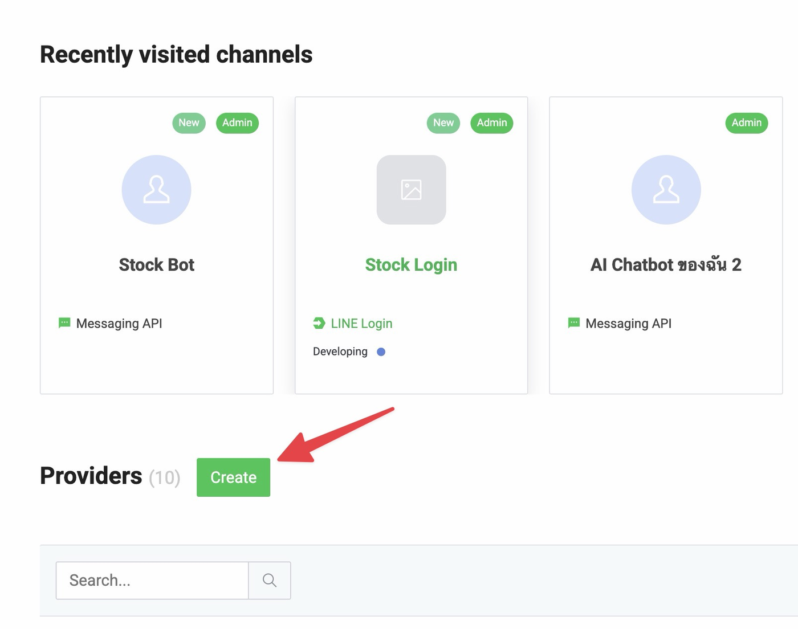
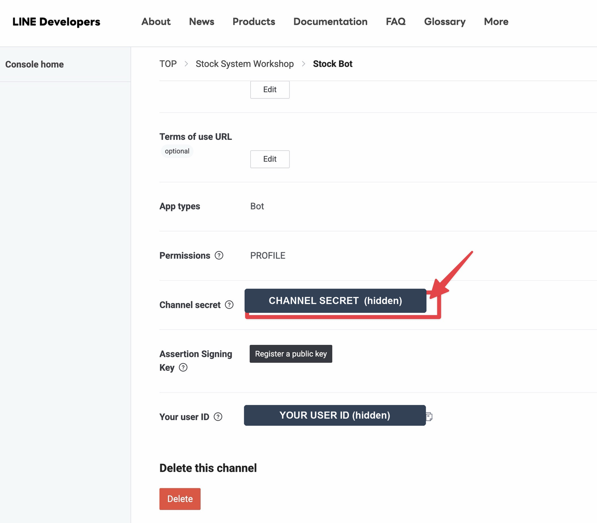
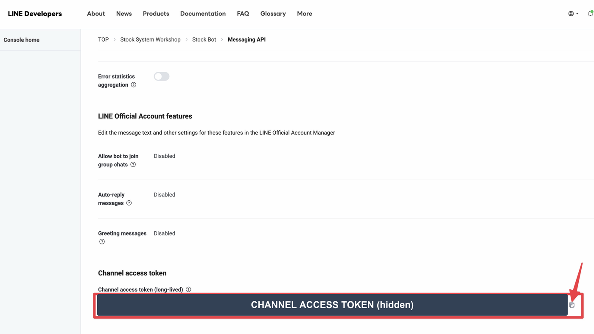
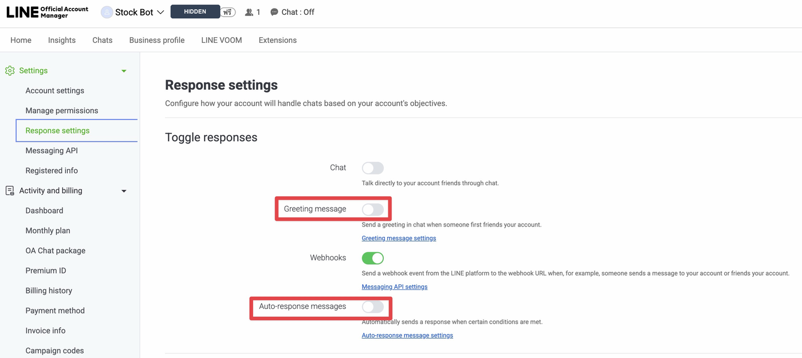
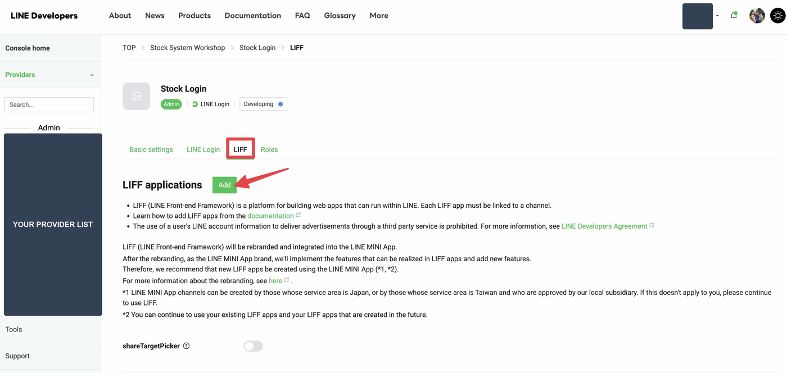

# ติดตั้งทีละขั้นด้วย OpenCode

คู่มือฉบับละเอียด สำหรับคนที่ **ไม่เคยเขียนโปรแกรมมาก่อน**
ตั้งแต่ยังไม่มีอะไรเลย จนบอทตอบข้อความได้จริง

⏱ **ใช้เวลาประมาณ 40 นาที** · 💰 **ไม่เสียเงิน ไม่ต้องผูกบัตรเครดิต**

> 📖 เจอศัพท์ไม่เข้าใจ เปิด [ศัพท์แปลเป็นภาษาคน](GLOSSARY.md) ไว้อีกแท็บ หรือถาม AI ได้ตลอด

---

## อ่านตรงนี้ก่อน 30 วินาที

ทั้งกระบวนการมีแค่ 2 บทบาทสลับกันไปมา:

| สัญลักษณ์ | หมายความว่า |
|---|---|
| 🧑 **คุณทำ** | คุณต้องไปกดเองบนเว็บ หรือพิมพ์ตอบ AI |
| 🤖 **AI ทำ** | นั่งดูเฉย ๆ AI จัดการให้ (แต่มันอาจขออนุญาตรันคำสั่ง ให้กดอนุญาต) |

**AI ทำแทนคุณไม่ได้อยู่ 3 จุด** คือตอนกดปุ่มบนเว็บ LINE Developers (ขั้นที่ 8, 10, 12)
เพราะมันมองไม่เห็นหน้าจอเบราว์เซอร์คุณ นอกนั้นมันทำให้หมด

---

# ตอนที่ 1 — เตรียมของ (10 นาที)

## ขั้นที่ 1 · สมัคร Cloudflare 🧑

ที่นี่คือที่ที่ระบบของคุณจะไปรันอยู่

1. เข้า **https://dash.cloudflare.com/sign-up**
2. กรอกอีเมล + ตั้งรหัสผ่าน → **Sign Up**
3. เปิดอีเมลไปกดยืนยัน

> ✅ **แผนฟรี ไม่ต้องใส่บัตรเครดิต** ถ้าเว็บถามหาแผน ให้เลือก **Free**
> ถ้าใช้เกินโควตา ระบบจะหยุดชั่วคราวจนถึงเที่ยงคืน ไม่ใช่เรียกเก็บเงินเพิ่ม

## ขั้นที่ 2 · เข้า LINE Developers 🧑

1. เข้า **https://developers.line.biz/console/**
2. กด **Log in with LINE account** แล้วล็อกอินด้วยบัญชี LINE ที่คุณใช้อยู่
3. ครั้งแรกจะให้กรอกชื่อผู้พัฒนากับอีเมล → กรอกแล้วกดยืนยัน

ยังไม่ต้องสร้างอะไร แค่เข้าให้ได้ก่อน เดี๋ยวขั้นที่ 8 ค่อยมาสร้าง

## ขั้นที่ 3 · ติดตั้ง OpenCode 🧑

OpenCode คือ AI ที่จะช่วยคุณติดตั้ง มีแบบหน้าต่างโปรแกรม (desktop app) ติดตั้งเหมือนโปรแกรมทั่วไป

1. เข้า **https://opencode.ai/download**
2. โหลดตามเครื่องคุณ
   - **Mac รุ่นใหม่ (M1/M2/M3/M4)** → macOS (Apple Silicon) `.dmg`
   - **Mac รุ่นเก่า (Intel)** → macOS (Intel) `.dmg`
   - **Windows** → Windows (x64) `.exe`
   - **Linux** → `.deb` หรือ `.rpm`
3. ติดตั้งตามปกติ (Mac: ลากไอคอนลงโฟลเดอร์ Applications · Windows: กด Next ไปเรื่อย ๆ)

> 💡 คนใช้ Mac ที่คุ้นเทอร์มินัลอยู่แล้ว พิมพ์ `brew install --cask opencode-desktop` ก็ได้

## ขั้นที่ 4 · เชื่อม OpenCode กับโมเดล AI 🧑

เปิดโปรแกรม OpenCode ครั้งแรก มันจะให้เลือกว่าจะใช้ AI ตัวไหน เลือกอย่างใดอย่างหนึ่ง

| ตัวเลือก | เหมาะกับใคร |
|---|---|
| **OpenCode Zen** | มือใหม่ที่ยังไม่มีอะไรเลย — ทีม OpenCode คัดโมเดลมาให้แล้ว |
| **ChatGPT Plus / Pro** | คนที่สมัคร ChatGPT รายเดือนอยู่แล้ว ใช้ของเดิมได้ |
| **GitHub Copilot** | คนที่มี Copilot อยู่แล้ว |
| **API key ของตัวเอง** | คนที่มี key ของ Anthropic / OpenAI / Google อยู่แล้ว |

ทำตามที่โปรแกรมบอกจนล็อกอินเสร็จ

> ⚠️ OpenCode desktop ยังเป็น **เวอร์ชัน beta** หน้าตาปุ่มอาจต่างจากที่เขียนไว้เล็กน้อย
> ถ้าหาปุ่มไม่เจอ ให้ดูที่เมนูตั้งค่า หรือใช้ [เวอร์ชันเทอร์มินัล](#ภาคผนวก-ข--ถ้า-desktop-app-มีปัญหา) แทนได้

---

# ตอนที่ 2 — ให้ AI เริ่มทำงาน (5 นาที)

## ขั้นที่ 5 · คัดลอกลิงก์โปรเจกต์ 🧑

ลิงก์ที่จะใช้คือ

```
https://github.com/ManageWithNoobItGuy/line-stock-bot
```

คัดลอกเก็บไว้ (หรือจำไว้ว่าอยู่ในคู่มือนี้ เดี๋ยวมันอยู่ในข้อความที่จะก๊อปอยู่แล้ว)

## ขั้นที่ 6 · สร้างโฟลเดอร์แล้วเปิดใน OpenCode 🧑

1. สร้างโฟลเดอร์เปล่าไว้เก็บโปรเจกต์ เช่น
   - Mac: `Documents/line-stock`
   - Windows: `Documents\line-stock`
2. ใน OpenCode เปิดโฟลเดอร์นั้น (มองหาเมนู **Open Folder** / **Open Project** / เลือก working directory)
3. เริ่มบทสนทนาใหม่ (New session / New chat)

## ขั้นที่ 7 · วางคำสั่งก้อนนี้แล้วกด Enter 🧑

**ก๊อปทั้งก้อน** ไม่ต้องแก้อะไร

```text
ช่วยติดตั้งระบบจัดการสต๊อกผ่าน LINE ให้ผมหน่อยครับ

โปรเจกต์อยู่ที่ https://github.com/ManageWithNoobItGuy/line-stock-bot
ให้ clone ลงมาในโฟลเดอร์นี้ก่อน แล้วอ่านไฟล์ AGENTS.md ในนั้นให้จบ
จากนั้นพาผมติดตั้งทีละขั้นตามที่เขียนไว้

ข้อมูลของผม:
- ผมเขียนโปรแกรมไม่เป็น อธิบายด้วยภาษาคนธรรมดา อย่าใช้ศัพท์เทคนิคลอย ๆ
- ผมยังไม่ได้สร้างอะไรใน LINE และ Cloudflare เลย
- ขั้นไหนที่คุณรันคำสั่งแทนผมได้ ให้รันเลย
- ขั้นไหนที่ผมต้องไปกดเองบนเว็บ ให้บอกชัด ๆ ว่าเข้าเว็บไหน กดปุ่มชื่ออะไร อยู่ตรงไหนของหน้า
  แล้วรอผมตอบว่าทำเสร็จแล้วก่อนไปขั้นถัดไป
- ถ้าต้องใช้ค่าอะไรจากผม ให้ถามทีละค่า
```

🤖 **AI จะเริ่มทำ:** โหลดโปรเจกต์ลงเครื่อง → อ่าน `AGENTS.md` → ตรวจว่าเครื่องคุณมี Node.js
และเครื่องมือที่ต้องใช้ครบไหม → ติดตั้งของที่ขาด → ล็อกอิน Cloudflare

**ระหว่างนี้:**
- ถ้ามันขออนุญาตรันคำสั่ง → **กดอนุญาต**
- ถ้ามันบอกว่าเครื่องยังไม่มี Node.js หรือ git → ให้มันติดตั้งให้ หรือทำตามที่มันบอก
- ตอนล็อกอิน Cloudflare จะมีเบราว์เซอร์เด้งขึ้นมาให้กด **Allow** → กดเลย

> 🆘 ถ้าติดตรงโหลดโปรเจกต์ (เช่นเครื่องไม่มี git) → ดู [ภาคผนวก ก](#ภาคผนวก-ก--ถ้าโหลดโปรเจกต์ไม่ได้)

---

# ตอนที่ 3 — สร้างบอท LINE (15 นาที)

## ขั้นที่ 8 · สร้าง Messaging API channel 🧑

AI จะบอกให้คุณมาทำขั้นนี้ ที่ **https://developers.line.biz/console/**

### 8.1 สร้าง Provider

1. เลื่อนลงหาหัวข้อ **Providers** แล้วกดปุ่มเขียว **Create**
2. ตั้งชื่อ (ชื่อบริษัท/ทีม/อะไรก็ได้) → **Create**



### 8.2 สร้างช่องของบอท

1. ในหน้า provider กด **Create a Messaging API channel**
2. กรอก:
   - **Channel name** — ชื่อบอทที่พนักงานจะเห็น เช่น `คลังสินค้า`
   - **Channel description** — คำอธิบายสั้น ๆ
   - **Category / Subcategory** — เลือกประเภทธุรกิจให้ใกล้เคียง
3. ติ๊กยอมรับเงื่อนไข → **Create**

### 8.3 เก็บค่าที่ 1 — Channel secret

แท็บ **Basic settings** → เลื่อนลงเกือบสุดหน้า จะเจอ **Channel secret** → กดไอคอนคัดลอกด้านขวา



> ค่าในภาพถูกปิดไว้ ของคุณจะเป็นตัวอักษรกับตัวเลข 32 ตัว
> **อย่าเผยแพร่ค่านี้ให้ใครเห็น**

### 8.4 เก็บค่าที่ 2 — Channel access token

แท็บ **Messaging API** → เลื่อนลงล่างสุด จะเจอหัวข้อ **Channel access token**
→ ถ้ายังว่างอยู่ให้กด **Issue** ก่อน → แล้วกดไอคอนคัดลอกด้านขวา



> สังเกตว่าในภาพ **Auto-reply messages** และ **Greeting messages** ขึ้นว่า `Disabled` แล้ว
> ถ้าของคุณยังขึ้น `Enabled` ให้ไปทำข้อ 8.5 ต่อ

### 8.5 ปิดข้อความอัตโนมัติ ⚠️ สำคัญ

**ยังอยู่แท็บ Messaging API** เลื่อนหาหัวข้อ **LINE Official Account features**
แล้วกด **Edit** ที่ **Auto-reply messages** — จะเด้งไปหน้า **LINE Official Account Manager**

ที่หน้านั้น เมนูซ้าย **Settings → Response settings** แล้วปิดสวิตช์ 2 อันนี้ให้เป็นสีเทา



- **Greeting message** → ปิด
- **Auto-response messages** → ปิด
- **Webhooks** → **เปิดไว้** (สีเขียว) ← อันนี้ห้ามปิด

> ถ้าไม่ปิด บอทจะตอบข้อความสำเร็จรูปของ LINE ซ้อนกับคำตอบจริงทุกครั้ง กวนมาก

### 8.6 ส่งค่าให้ AI 🧑

กลับมาที่ OpenCode แล้วพิมพ์บอกมัน (AI จะถามทีละค่าอยู่แล้ว ตอบตามที่มันถาม)

```text
Channel secret คือ xxxxxxxxxxxxx
Channel access token คือ xxxxxxxxxxxxx
ปิด Auto-reply กับ Greeting messages เรียบร้อยแล้วครับ
```

> 🔐 AI จะเอาค่านี้ไปเก็บแบบเข้ารหัสไว้ที่ Cloudflare ด้วยคำสั่ง `wrangler secret put`
> **ไม่ได้เขียนลงไฟล์** และไฟล์ลับก็ถูกกันไม่ให้ขึ้น GitHub อยู่แล้ว

## ขั้นที่ 9 · AI สร้างฐานข้อมูลและส่งระบบขึ้นใช้งาน 🤖

นั่งดูเฉย ๆ AI จะ:
1. สร้างฐานข้อมูล D1 บนบัญชีคุณ
2. สร้างตารางทั้งหมด (migration)
3. เก็บค่าลับ 2 ตัวจากขั้นที่แล้ว
4. ส่งระบบขึ้นใช้งานจริง (deploy)

**สิ่งที่คุณจะได้กลับมาคือ URL** หน้าตาประมาณ

```
https://line-stock.xxxxx.workers.dev
```

📌 **จดไว้ ใช้ต่อในขั้นที่ 10 และ 12**

## ขั้นที่ 10 · สร้าง LINE Login + LIFF 🧑

กลับไปที่ **https://developers.line.biz/console/** → เข้า provider เดิม

### 10.1 สร้าง LINE Login channel

1. กด **Create a LINE Login channel**
2. กรอกชื่อ (เช่น `แดชบอร์ดสต๊อก`) คำอธิบาย ประเภทแอป → เลือก **Web app**
3. **Create**

### 10.2 เก็บ Channel ID

แท็บ **Basic settings** → เก็บ **Channel ID** (ตัวเลข 10 หลัก)

### 10.3 สร้าง LIFF app

แท็บ **LIFF** → กดปุ่มเขียว **Add**



| ช่อง | ใส่อะไร |
|---|---|
| **LIFF app name** | ชื่ออะไรก็ได้ เช่น `แดชบอร์ดสต๊อก` |
| **Size** | **Full** |
| **Endpoint URL** | **URL ที่ได้จากขั้นที่ 9** |
| **Scopes** | ติ๊ก **`profile`** และ **`openid`** |
| **Scan QR** | **เปิด** |

กด **Add**

> ⚠️ **จุดที่คนพลาดมากที่สุดคือลืมติ๊ก `openid`** ถ้าลืม เปิดแดชบอร์ดแล้วจะขึ้นว่า "เซสชันหมดอายุ"
> แก้ได้ทีหลังโดยกลับมาติ๊กเพิ่ม

### 10.4 เก็บ LIFF ID แล้วส่งให้ AI 🧑

LIFF ID หน้าตาเช่น `1234567890-abcdefgh` (ขึ้นต้นด้วย Channel ID ของ LINE Login)

```text
LIFF ID คือ 1234567890-abcdefgh
Channel ID ของ LINE Login คือ 1234567890
```

## ขั้นที่ 11 · AI ส่งระบบขึ้นอีกรอบ 🤖

AI จะเอา LIFF ID ไปใส่ไฟล์ตั้งค่าแล้ว deploy ซ้ำ รอบนี้แดชบอร์ดถึงจะเปิดได้จริง

## ขั้นที่ 12 · เปิด Webhook 🧑

กลับไปที่ **Messaging API channel** (ช่องของบอท) → แท็บ **Messaging API** → หัวข้อ **Webhook settings**

1. **Webhook URL** ใส่ URL จากขั้นที่ 9 **แล้วต่อท้ายด้วย `/line/webhook`**

   ```
   https://line-stock.xxxxx.workers.dev/line/webhook
   ```

2. กด **Update** แล้วกด **Verify**

   ✅ ขึ้น **Success** = ถูกต้อง
   ❌ ขึ้น error = บอก AI ว่า *"กด Verify แล้วขึ้น error แบบนี้"* พร้อมวางข้อความที่เห็น

   > 💡 บอก AI ก่อนได้ว่า *"ช่วยทดสอบให้หน่อยว่ากด Verify แล้วจะผ่านไหม"* มันเช็คแทนคุณได้

3. **เปิดสวิตช์ Use webhook** ← ถ้าไม่เปิด บอทจะเงียบสนิท

---

# ตอนที่ 4 — เก็บงานและทดสอบ (10 นาที)

## ขั้นที่ 13 · ติดตั้งริชเมนู 🤖

บอก AI ว่า

```text
ช่วยติดตั้งริชเมนูให้ด้วยครับ
```

จะได้เมนูรูปภาพ 6 ปุ่มด้านล่างห้องแชท (แดชบอร์ด · เช็คสต๊อก · เบิกของ · รับเข้า · ของใกล้หมด · วิธีใช้)

> ขั้นนี้ต้องมี **Google Chrome** ในเครื่อง (ใช้สร้างรูปเมนู) ถ้าไม่มี ข้ามไปก่อนได้ ระบบใช้งานได้ปกติ

## ขั้นที่ 14 · ใส่ข้อมูลเริ่มต้น 🧑

เลือกอย่างใดอย่างหนึ่ง แล้วบอก AI

**อยากลองเล่นก่อน** (แนะนำสำหรับครั้งแรก)
```text
ช่วยใส่ข้อมูลตัวอย่างให้หน่อยครับ
```
จะได้ 3 คลัง 6 สินค้าพร้อมบาร์โค้ด ลบทีหลังได้ในแดชบอร์ด

**อยากเริ่มจากของจริงเลย** — ข้ามไปเลย แล้วไปเพิ่มคลังกับสินค้าเองในแดชบอร์ด
แท็บ *ตั้งค่า* → *เพิ่มคลัง* แล้วแท็บ *สินค้า* → *เพิ่มสินค้าใหม่*

## ขั้นที่ 15 · ทดสอบว่าใช้ได้จริง 🧑

### 15.1 แอดบอทเป็นเพื่อน

LINE Console → Messaging API channel → แท็บ **Messaging API** → มี **QR code** อยู่
เปิดแอป LINE ในมือถือ → สแกน → **Add**

### 15.2 ไล่เช็คทีละข้อ

- [ ] พิมพ์ `ช่วยเหลือ` → **ได้การ์ดวิธีใช้กลับมา**
      ← ข้อนี้ผ่าน = บอทกับ webhook ใช้งานได้แล้ว 🎉
- [ ] พิมพ์ `สรุป` → ได้การ์ดภาพรวมตัวเลข
- [ ] พิมพ์ `เช็ค ปากกา` → ได้การ์ดสินค้าพร้อมยอดคงเหลือแยกคลัง
- [ ] พิมพ์ `เบิก ปากกา 5` → ได้การ์ดให้เลือกคลัง → กดเลือก → **ได้การ์ดยืนยัน**
- [ ] กด **ยืนยัน** ในการ์ด → ขึ้นว่าบันทึกสำเร็จพร้อมเลขที่รายการ
- [ ] พิมพ์ `ประวัติ` → เห็นรายการที่เพิ่งเบิกไป
- [ ] กดปุ่ม **แดชบอร์ด** ในริชเมนู (หรือเปิด `https://liff.line.me/<LIFF ID ของคุณ>`)
      → **หน้าแดชบอร์ดเปิดขึ้นในแอป LINE**
      ← ข้อนี้ผ่าน = ครบทั้งระบบแล้ว 🎉
- [ ] ในแดชบอร์ด กดปุ่มวงกลมกลางแถบล่าง → สแกนบาร์โค้ดสินค้า → เปิดการ์ดสินค้าได้

**ผ่านหมด = ติดตั้งเสร็จสมบูรณ์** 🎊
อ่านวิธีใช้งานทั้งหมดต่อได้ที่ [คู่มือการใช้งาน](USAGE.md)

---

# ถ้าติดปัญหา

## บอก AI ให้ถูกวิธี

**อย่าพิมพ์แค่ "ไม่ได้" หรือ "พัง"** ให้บอก 3 อย่าง

```text
ผมติดที่ขั้นที่ [เลข] เรื่อง [ชื่อขั้นตอน]
ผมทำ [สิ่งที่ทำ] แล้วขึ้นแบบนี้:

[วางข้อความ error ทั้งก้อน]
```

ยิ่งวาง error มาทั้งก้อน AI ยิ่งแก้ตรงจุด **ไม่ต้องกลัวว่ายาวเกินไป**

## อาการที่เจอบ่อยระหว่างติดตั้ง

| อาการ | ปกติแล้วเกิดจาก |
|---|---|
| กด Verify webhook ไม่ผ่าน | Channel secret ไม่ตรง — บอก AI ให้ใส่ใหม่ |
| บอทเงียบ ไม่ตอบเลย | ยังไม่เปิดสวิตช์ **Use webhook** (ขั้นที่ 12 ข้อ 3) |
| บอทตอบ 2 ข้อความซ้อนกัน | ยังไม่ปิด Auto-reply (ขั้นที่ 8.5) |
| แดชบอร์ดค้างที่ "กำลังเชื่อมต่อ LINE…" | LIFF ID ผิด หรือ Endpoint URL ไม่ตรงกับ URL จริง |
| แดชบอร์ดขึ้น "เซสชันหมดอายุ" | ลืมติ๊ก `openid` ตอนสร้าง LIFF (ขั้นที่ 10.3) |
| แดชบอร์ดเปิดได้แต่ว่างเปล่า | ยังไม่มีข้อมูล → ขั้นที่ 14 |

รายการเต็มอยู่ที่ [แก้ปัญหาที่พบบ่อย](TROUBLESHOOTING.md) — หรือบอก AI ให้เปิดไฟล์นั้นอ่านก็ได้

## อยากรื้อเริ่มใหม่

ระบบนี้ลบแล้วสร้างใหม่ได้ ไม่เสียหายอะไร

```text
ผมอยากเริ่มติดตั้งใหม่ทั้งหมด
ช่วย export ข้อมูลเก็บไว้ก่อน แล้วลบ Worker กับฐานข้อมูล D1 ที่สร้างไว้
จากนั้นเริ่มติดตั้งใหม่ตั้งแต่ต้นให้หน่อยครับ
```

**ฝั่ง LINE ไม่ต้องลบ** ใช้ channel เดิมได้ แค่กลับไปแก้ 2 จุดให้เป็น URL ใหม่
คือ Endpoint URL ของ LIFF และ Webhook URL

---

# 3 ข้อห้าม

1. **ห้ามเอา Channel access token / Channel secret ไปโพสต์ที่สาธารณะ**
   (คอมเมนต์ YouTube, กลุ่ม Facebook, GitHub issue)
   เผลอหลุด → LINE Console กด **Reissue** ออกตัวใหม่ทันที ของเก่าใช้ไม่ได้แล้ว
2. **ห้ามอัปไฟล์ `.dev.vars` ขึ้น GitHub** — โปรเจกต์กันไว้ให้แล้ว ถ้า AI จะแก้ `.gitignore` ให้ห้ามไว้
3. **ห้ามให้ AI ปิดการตรวจลายเซ็น webhook เพื่อให้ผ่าน ๆ ไป**
   นั่นคือประตูที่กันคนอื่นยิงคำสั่งปลอมเข้าระบบคุณ ถ้าติดตรงนั้นต้องแก้ที่ Channel secret ให้ตรง

---

# ภาคผนวก

## ภาคผนวก ก · ถ้าโหลดโปรเจกต์ไม่ได้

ถ้า AI บอกว่าเครื่องไม่มี `git` และติดตั้งไม่ผ่าน ใช้วิธีโหลดไฟล์ซิปแทนได้

1. เข้า https://github.com/ManageWithNoobItGuy/line-stock-bot
2. กดปุ่มเขียว **Code** → **Download ZIP**
3. แตกไฟล์ แล้วเอาไฟล์ทั้งหมดไปไว้ในโฟลเดอร์ที่เปิดใน OpenCode
4. บอก AI ว่า

```text
ผมโหลดไฟล์โปรเจกต์มาวางในโฟลเดอร์นี้แล้ว (ไม่ได้ใช้ git)
ช่วยอ่าน AGENTS.md แล้วพาผมติดตั้งต่อได้เลยครับ
```

## ภาคผนวก ข · ถ้า desktop app มีปัญหา

OpenCode มีเวอร์ชันเทอร์มินัลที่เสถียรกว่า (แต่ต้องพิมพ์คำสั่งเอง)

```bash
curl -fsSL https://opencode.ai/install | bash   # ติดตั้ง
opencode auth login                              # เชื่อมโมเดล AI
cd โฟลเดอร์โปรเจกต์ของคุณ
opencode                                         # เปิดใช้งาน
```

แล้ววางข้อความจากขั้นที่ 7 ได้เหมือนกัน

## ภาคผนวก ค · ใช้ AI ตัวอื่นแทน OpenCode

โปรเจกต์นี้ใช้ไฟล์ `AGENTS.md` ซึ่งเป็นมาตรฐานกลาง **AI ตัวไหนก็อ่านได้**

| เครื่องมือ | ใช้ได้เลยไหม |
|---|---|
| **Cursor** | ได้ทันที (มี UI ให้เห็นไฟล์ เหมาะกับมือใหม่เหมือนกัน) |
| **Codex / Windsurf** | ได้ทันที |
| **Claude Code** | ได้ทันที (มีไฟล์ `CLAUDE.md` ที่ดึง `AGENTS.md` เข้ามาให้แล้ว) |
| **Gemini CLI** | ต้องตั้งค่าให้อ่าน `AGENTS.md` ก่อนหนึ่งครั้ง |

ขั้นตอนอื่นเหมือนกันทุกอย่าง ใช้ข้อความจากขั้นที่ 7 ได้เลย

## ภาคผนวก ง · ปรับแต่งต่อหลังติดตั้งเสร็จ

สั่ง AI ได้เลย เช่น

> เปลี่ยนสีธีมแดชบอร์ดเป็นโทนน้ำเงิน

> เพิ่มคำสั่ง "คืนของ" ให้ทำงานเหมือนรับเข้า แต่บันทึกหมายเหตุว่าเป็นการคืน

> เพิ่มฟิลด์ราคาต่อหน่วยในสินค้า แล้วโชว์มูลค่าสต๊อกรวมในหน้าภาพรวม

> ทำให้บอทส่งสรุปของใกล้หมดเข้ากลุ่มทุกเช้า 8 โมง

> เพิ่มการแยกสิทธิ์ ให้เฉพาะคนที่กำหนดเท่านั้นที่แก้ข้อมูลสินค้าได้

ในไฟล์ `AGENTS.md` มีตารางบอกว่าฟีเจอร์ไหนต้องแก้ไฟล์ไหน AI จะแก้ถูกที่โดยไม่รื้อโค้ดมั่ว

> 💡 ก่อนให้ AI แก้อะไรใหญ่ ๆ สั่งว่า *"ช่วย commit ของเดิมเก็บไว้ก่อน"* จะได้ย้อนกลับได้ถ้าไม่ถูกใจ
